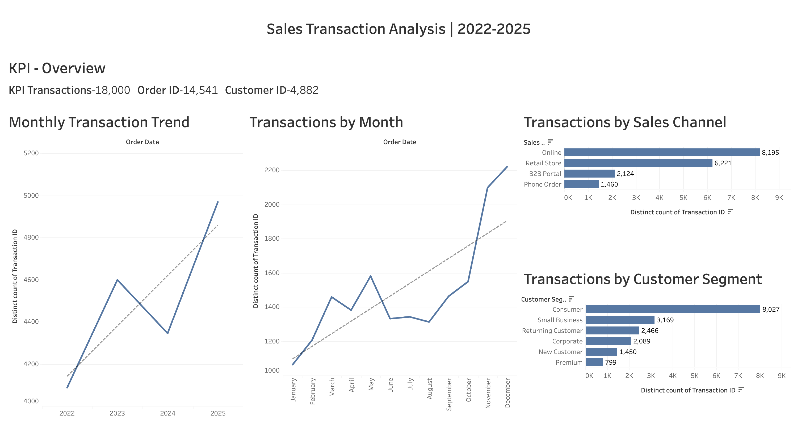
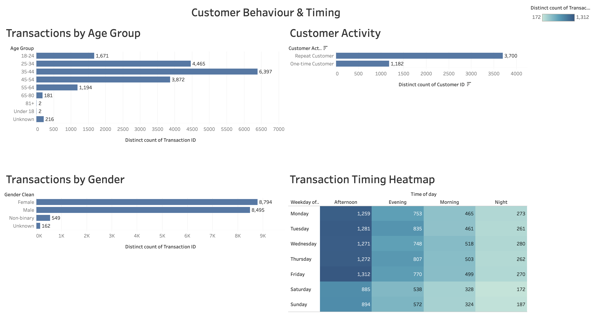

# Sales Transaction & Customer Behaviour Analysis

## Project Overview

This project analyses **18,000 unique sales transactions from 2022 to 2025** to understand customer purchasing behaviour, transaction trends, sales channel performance, customer demographics, seasonality, and purchasing patterns.

The project was developed using **Tableau Public and Excel**, with a focus on transforming raw transactional data into clear, interactive dashboards and actionable business insights.

The analysis demonstrates practical skills in:

- Data Cleaning
- Exploratory Data Analysis
- Tableau Dashboard Development
- Data Visualisation
- Customer Behaviour Analysis
- Business Insight Generation

---

## Business Problem

The objective of this project is to understand:

> **How can the business better understand customer purchasing behaviour and transaction patterns across sales channels, customer segments, demographics, and time periods between 2022 and 2025?**

The analysis focuses on identifying transaction trends, customer behaviour, seasonality, channel performance, and repeat purchasing activity.

---

## Business Questions

The project answers the following questions:

1. How has transaction activity changed between 2022 and 2025?
2. Which sales channels generate the highest transaction activity?
3. Which customer segments are the most active?
4. Which age groups contribute the most transactions?
5. How is transaction activity distributed across gender groups?
6. Which months experience the highest transaction activity?
7. Which days and times experience the greatest transaction volumes?
8. What proportion of customers make repeat purchases?
9. How do different customer segments use different sales channels?

---

## Dataset

The dataset contains sales transaction records covering the period from **2022 to 2025**.

### Key Fields

- Transaction ID
- Order ID
- Customer ID
- Customer Name
- Customer Age
- Customer Gender
- Customer Segment
- Order Date
- Order Time
- Sales Channel

### Dataset Summary

- **Original Records:** 18,045
- **Unique Transactions:** 18,000
- **Orders:** 14,541
- **Customers:** 4,882
- **Period Covered:** January 2022 – December 2025

---

## Data Cleaning

Before performing the analysis, several data-quality checks were completed.

### Cleaning Steps

- Identified duplicate transaction records
- Removed duplicate transactions
- Standardised inconsistent gender values
- Checked missing demographic information
- Reviewed unusual customer age values
- Created customer age groups
- Created transaction time categories
- Created customer activity classifications
- Used distinct transaction counts to prevent duplicate counting

### Data Quality Issues Identified

- Duplicate transaction records
- Missing customer demographic values
- Inconsistent gender labels
- Unusual customer age values

Rather than ignoring these issues, data-quality checks were incorporated into the analysis process.

---

## Tools Used

| Tool | Purpose |
|---|---|
| **Tableau Public** | Data visualisation and interactive dashboards |
| **Microsoft Excel** | Initial data cleaning and preparation |
| **GitHub** | Project documentation and portfolio hosting |

---

## Tableau Calculated Fields

Several calculated fields were created in Tableau to support the analysis.

### Gender Clean

Used to standardise inconsistent gender labels and group missing values as Unknown.

### Age Group

Customers were grouped into the following age categories:

- Under 18
- 18–24
- 25–34
- 35–44
- 45–54
- 55–64
- 65–80
- 81+
- Unknown

### Age Quality Flag

Customer age values were classified as:

- Valid Range
- Potential Outlier
- Missing

### Order Hour

The hour was extracted from the Order Time field using Tableau's DATEPART function.

### Time of Day

Transaction times were grouped into:

- Morning
- Afternoon
- Evening
- Night

### Orders Per Customer

A Level of Detail calculation was used to calculate the number of distinct orders placed by each customer.

### Customer Activity Type

Customers were classified as:

- One-time Customer
- Repeat Customer

---

# Analysis & Key Insights

## 1. Transaction Trend

Transaction activity increased overall between 2022 and 2025.

| Year | Transactions |
|---|---:|
| 2022 | 4,087 |
| 2023 | 4,599 |
| 2024 | 4,345 |
| 2025 | 4,969 |

### Insight

Transaction activity increased by approximately **21.6% between 2022 and 2025**.

Although transaction activity declined slightly in 2024, it recovered strongly in 2025 and reached the highest level of the four-year period.

---

## 2. Sales Channel Performance

| Sales Channel | Transactions | Share |
|---|---:|---:|
| Online | 8,195 | 45.5% |
| Retail Store | 6,221 | 34.6% |
| B2B Portal | 2,124 | 11.8% |
| Phone Order | 1,460 | 8.1% |

### Insight

**Online was the leading sales channel**, accounting for approximately **45.5% of total transaction activity**.

Online and Retail Store together represented approximately **80% of transactions**.

---

## 3. Customer Segment Analysis

| Customer Segment | Transactions | Share |
|---|---:|---:|
| Consumer | 8,027 | 44.6% |
| Small Business | 3,169 | 17.6% |
| Returning Customer | 2,466 | 13.7% |
| Corporate | 2,089 | 11.6% |
| New Customer | 1,450 | 8.1% |
| Premium | 799 | 4.4% |

### Insight

The **Consumer segment** generated the highest level of transaction activity, accounting for approximately **44.6% of all transactions**.

---

## 4. Customer Age Analysis

The highest transaction activity came from customers aged **25–54**.

| Age Group | Transactions |
|---|---:|
| 25–34 | 4,465 |
| 35–44 | 6,397 |
| 45–54 | 3,872 |

### Insight

Customers aged **25–54 represented approximately 81.9% of transaction activity**, making this the most active demographic group in the dataset.

---

## 5. Gender Distribution

Transaction activity was relatively balanced between male and female customers.

| Gender | Approx. Share |
|---|---:|
| Female | 48.9% |
| Male | 47.2% |
| Non-binary | 3.1% |
| Unknown | 0.9% |

### Insight

There was no major gender concentration in the transaction data, with male and female customer activity remaining relatively balanced.

---

## 6. Monthly Seasonality

Transaction activity increased significantly towards the end of the year.

| Month | Transactions |
|---|---:|
| January | 1,062 |
| February | 1,206 |
| March | 1,458 |
| April | 1,381 |
| May | 1,580 |
| June | 1,331 |
| July | 1,342 |
| August | 1,312 |
| September | 1,462 |
| October | 1,548 |
| November | 2,098 |
| December | 2,220 |

### Insight

**November and December were the busiest months**, with December recording the highest transaction activity in the dataset.

This suggests a strong end-of-year seasonal pattern.

---

## 7. Transaction Timing

Transaction activity was analysed by day of the week and time of day.

### Time-of-Day Distribution

| Time of Day | Share |
|---|---:|
| Afternoon | 45.4% |
| Evening | 27.9% |
| Morning | 17.2% |
| Night | 9.5% |

### Insight

The **afternoon was the busiest transaction period**, representing approximately **45.4% of activity**.

Approximately **78.3% of transactions occurred between Monday and Friday**, with weekday afternoons showing particularly high activity.

---

## 8. Repeat Customer Behaviour

Customers were classified based on the number of orders they placed.

| Customer Type | Customers |
|---|---:|
| One-time Customers | 1,182 |
| Repeat Customers | 3,700 |

### Insight

Approximately **75.8% of customers placed more than one order** during the analysed period.

This indicates that repeat customers represent an important part of the customer base.

---

# Tableau Dashboards

## Sales Transaction Overview

The main dashboard provides an executive overview of:

- Total Transactions
- Total Orders
- Total Customers
- Transaction Trends
- Sales Channel Performance
- Customer Segment Performance

---

## Customer Behaviour Dashboard

The customer behaviour dashboard explores:

- Age Distribution
- Gender Distribution
- Customer Activity
- Monthly Seasonality
- Transaction Timing
- Customer Purchasing Patterns

---

# Tableau Public

The interactive version of the dashboard is available on Tableau Public.

**[View Interactive Tableau Dashboard](https://public.tableau.com/views/SalesTransactionandCustomerBehaviourAnalysis/CustomerBehaviourTiming?:language=en-GB&:sid=&:redirect=auth&:display_count=n&:origin=viz_share_link)**

---

# Business Recommendations

## 1. Strengthen the Online Channel

Online accounts for approximately **45.5% of transactions**, making it the largest sales channel.

The business should continue to prioritise the online customer experience and investigate opportunities to further improve digital engagement.

## 2. Prepare for End-of-Year Demand

November and December record substantially higher transaction volumes.

Operational resources, customer support, platform capacity, and promotional activity could be reviewed ahead of this period.

## 3. Focus on Core Customer Demographics

Customers aged **25–54 generate approximately 82% of transactions**.

Further analysis of this demographic could help identify customer preferences and engagement opportunities.

## 4. Understand Repeat Customer Behaviour

Approximately **76% of customers placed more than one order**.

Future analysis could incorporate revenue, purchase frequency, recency, and customer lifetime value to better understand the value of repeat customers.

## 5. Align Resources With Peak Transaction Periods

Transaction activity is concentrated during weekdays and particularly during afternoon hours.

Operational and customer-service resources could be aligned with these peak periods.

---

# Limitations

This dataset does not contain:

- Revenue
- Profit
- Product information
- Quantity
- Cost
- Unit price

Therefore, the analysis focuses on **transaction volume and customer behaviour rather than financial performance**.

Future analysis could be expanded by incorporating revenue, product, profit, and quantity information.

---

# Project Files

The repository contains:

- `Sales_transactions_2022_2025_raw.csv` — Original dataset
- `Sales_transactions_2022_2025-cleaned.xlsx` — Cleaned dataset
- Tableau workbook — Interactive Tableau analysis
- `dashboard_overview.png` — Sales transaction dashboard
- `customer_behaviour_dashboard.png` — Customer behaviour dashboard
- `README.md` — Project documentation

---

# Skills Demonstrated

- Tableau
- Excel
- Data Cleaning
- Exploratory Data Analysis
- Data Visualisation
- Dashboard Development
- Customer Segmentation
- Trend Analysis
- Customer Behaviour Analysis
- Business Analysis
- Data Quality Assessment
- Business Insight Generation
- GitHub Documentation

---

# Author

**Riddhi Patel**

MSc Artificial Intelligence  
Data Analytics | Tableau | Python | SQL | Power BI

[LinkedIn](https://www.linkedin.com/in/riddhi-patel-46a3762ab?utm_source=share_via&utm_content=profile&utm_medium=member_ios)

[Tableau Public](https://public.tableau.com/views/SalesTransactionandCustomerBehaviourAnalysis/CustomerBehaviourTiming?:language=en-GB&:sid=&:redirect=auth&:display_count=n&:origin=viz_share_link)

[GitHub](https://github.com/Riddhi21032003)
